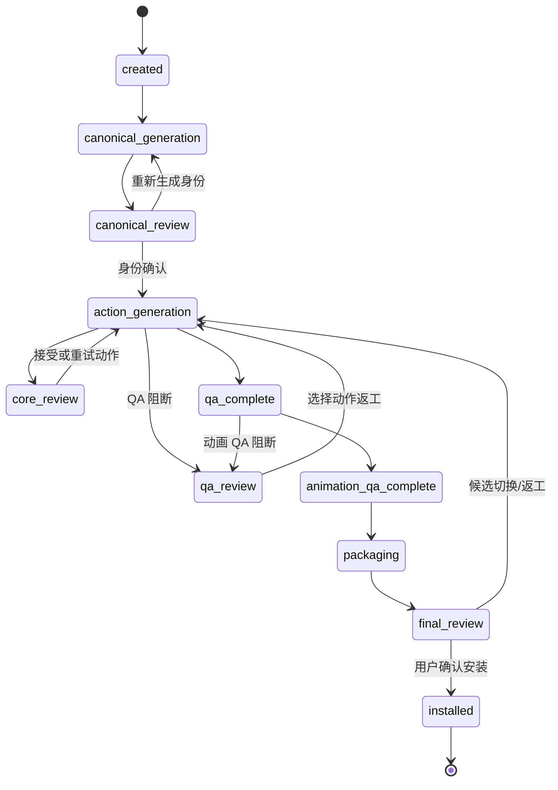

# 伙伴工坊状态机

伙伴工坊工作流版本：`2`
任务清单兼容版本：`1`

工作流版本独立于任务清单版本。新清单仍保留 `schema_version: 1`，并增加
`workflow_schema_version: 2`。因此旧版 Pixkin 会忽略新增字段并继续读取任务；
新版会把缺少工作流版本的旧任务在内存中迁移，下一次更新时原子写回。

## 主流程



除 `installed` 外，运行阶段可以进入 `failed` 或 `canceled`。恢复时优先回到发生中断前的
审核阶段；生成、QA 或打包阶段发生中断时回到安全的生成入口，重新检查已有产物后继续。

## 阶段契约

| 阶段 | 允许状态 | 必需输入/产物 | 失败后的重试入口 |
| --- | --- | --- | --- |
| `created` | `pending` | 请求、任务列表 | 身份生成 |
| `canonical_generation` | `pending/running` | 参考图、身份任务 | 身份生成 |
| `canonical_review` | `needs_review` | `canonical` | 身份生成 |
| `action_generation` | `pending/running` | 已确认身份 | 动作生成 |
| `core_review` | `needs_review` | 核心接触表、核心 QA | 动作生成 |
| `qa_review` | `needs_review` | 最终接触表、QA 报告 | 动作生成 |
| `qa_complete` | `running` | 最终接触表、静态 QA | 动作生成 |
| `animation_qa_complete` | `running` | 动画 QA、GIF 预览 | 动作生成 |
| `packaging` | `running` | 已完成动作与动画 | 动作生成 |
| `final_review` | `needs_review` | ZIP、静态 QA、动画 QA | 动作生成 |
| `installed` | `complete` | ZIP、已安装角色 ID | 不可继续 |
| `failed` | `failed` | 错误摘要 | 按状态历史恢复 |
| `canceled` | `canceled` | 已完成的安全检查点 | 按状态历史恢复 |

## 状态历史

每次阶段或运行状态变化都会追加：

```json
{
  "from": "action_generation",
  "to": "core_review",
  "status": "needs_review",
  "at": "2026-07-26T00:00:00+00:00",
  "reason": "update_stage"
}
```

加载任务时会校验历史首项、前后衔接、阶段合法性、阶段/状态组合，以及最后一项是否与
当前状态一致。历史链被篡改或断裂时任务不会继续执行。

## 旧任务迁移

- 旧 `running` 阶段映射到 `action_generation`。
- 旧 `ready` 阶段映射到 `final_review`，重新要求安装确认。
- 已知旧阶段保持原义，并补建一条 `migrated_from_v1` 历史。
- 未识别阶段根据 `failed/canceled` 状态安全归类；其余回到 `created`。
- 迁移不删除任务、候选、审核、调用统计或产物路径。
